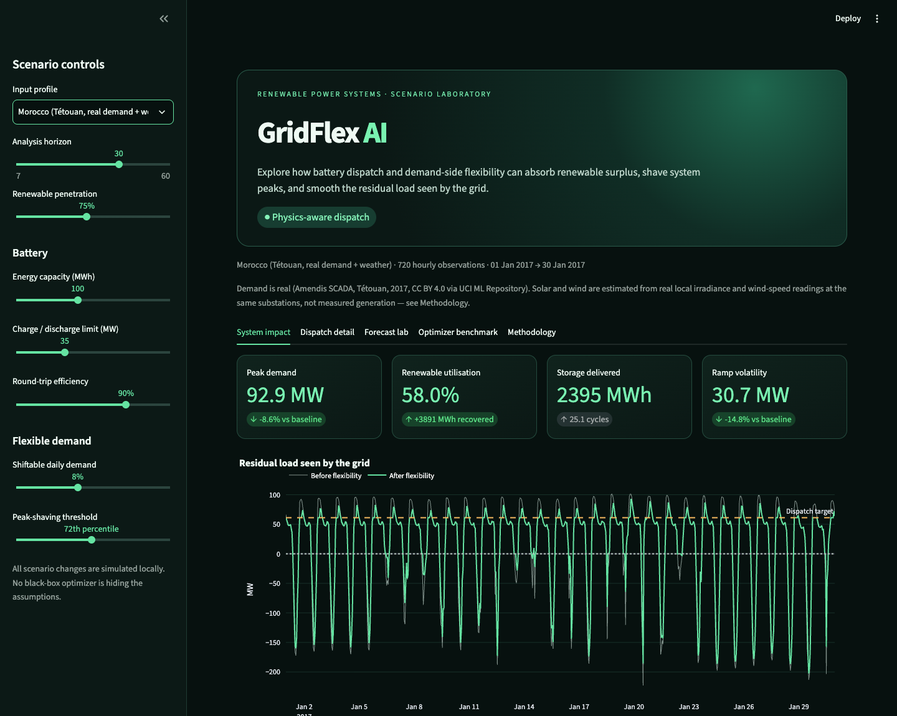
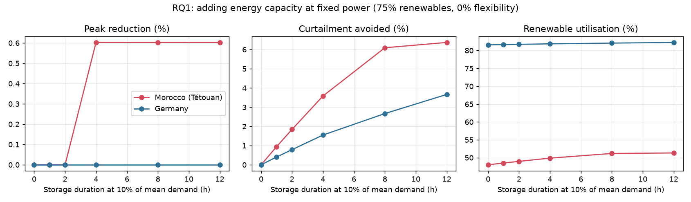
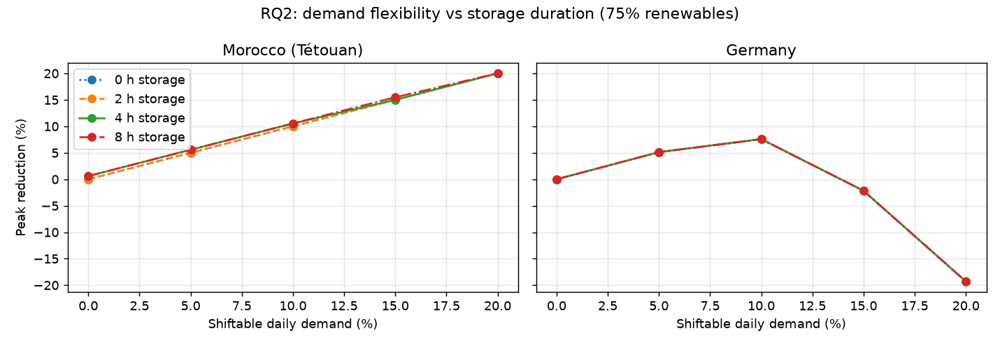
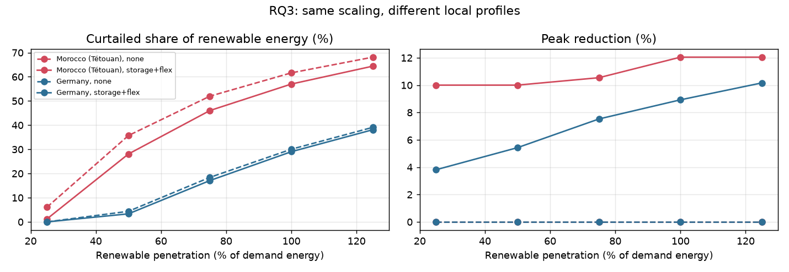

# GridFlex AI

[](https://github.com/hajarmrifag/gridflex-ai/actions/workflows/test.yml)


[**Live demo**](https://gridflex-energy-sim.streamlit.app/) · [Results](#results) · [Methodology](docs/methodology.md) · [Data provenance](data/README.md) · [Source](src/)

**An interactive battery-dispatch and demand-flexibility laboratory for
renewable power systems.**

GridFlex turns an energy-transition question into a reproducible software
experiment: when wind and solar production do not align with electricity demand,
how much can storage and load shifting reduce peaks and recover surplus energy?

The project is intentionally small enough to audit and serious enough to extend.
It combines hourly public power-system data, physical battery constraints,
energy-conserving demand response, chronological forecasting, and a polished
Streamlit scenario dashboard.



## Why this matters

As wind and solar supply a larger share of electricity, the grid's problem shifts
from *generating* enough energy to *matching* it in time: midday solar surplus
gets curtailed, and evening net-load peaks still need firm capacity. Storage and
demand response are two of the main flexibility options for closing that gap.
GridFlex is a small, transparent experiment on how far each option goes, and on
how the answer depends on the local demand and weather profile.

## What makes it useful

- Models state of charge, charge/discharge power, minimum reserve, and losses.
- Shifts flexible demand **within each day without creating or deleting energy**.
- Quantifies peak reduction, renewable utilisation, curtailment, throughput,
  equivalent battery cycles, and residual-load volatility.
- Compares an ML demand forecast against a naive day-ahead baseline on a true
  chronological holdout.
- Exposes every major assumption in the interface and documents limitations.
- Runs offline with two bundled real public-data samples (Germany, Morocco)
  or a deterministic synthetic stress test.

## Dashboard

The sidebar controls renewable penetration, storage energy and power, round-trip
efficiency, demand flexibility, and the peak-shaving threshold. Five views explain
both the outcome and the mechanism:

1. **System impact**: headline metrics and before/after residual load.
2. **Dispatch detail**: charge, discharge, state of charge, and shifted load.
3. **Forecast lab**: chronological model evaluation against persistence.
4. **Optimizer benchmark**: the causal heuristic vs. a linear-programming
   perfect-foresight upper bound, isolating the battery's own contribution
   from demand flexibility's.
5. **Methodology**: assumptions and claims the prototype deliberately avoids.

## Results

All numbers below come from [`scripts/run_experiments.py`](scripts/run_experiments.py)
(reproducible with `pip install matplotlib && python scripts/run_experiments.py`). Setup: the first 60 days
of each bundled sample (Tétouan: Jan-Feb 2017; Germany: Jan-Mar 2015), renewables
scaled to 75% of demand energy unless stated, 90% round-trip efficiency, and
peak-shaving threshold at the 72nd percentile of positive net load. Batteries are
sized **relative to each system's mean demand** (power = 10% of mean demand,
energy = duration x power) so a city-scale and a national-scale system are
comparable. "Curtailment" means renewable output exceeding instantaneous demand
with no export; both regions are treated as isolated systems.

### RQ1: what does extra battery energy capacity buy at fixed power?



| System | Storage duration | Curtailment avoided | Renewable utilisation | Peak reduction |
|---|---|---|---|---|
| Tétouan | none | 0% | 48.0% | 0% |
| Tétouan | 4 h | 3.6% | 49.9% | 0.6% |
| Tétouan | 12 h | 6.4% | 51.3% | 0.6% |
| Germany | none | 0% | 81.6% | 0% |
| Germany | 4 h | 1.6% | 81.9% | 0% |
| Germany | 12 h | 3.6% | 82.3% | 0% |

Curtailment avoided keeps growing with duration, but with diminishing returns
(Tétouan gains 3.6 points from 0 to 4 h and 2.8 more from 4 to 12 h). At a fixed
power rating, more energy capacity cannot remove the bulk of curtailment: at 75%
renewables, Tétouan still wastes about half of its renewable energy even with 12 h
of storage, because the surplus is far larger than a 10%-of-demand battery can absorb.

**The threshold heuristic captures almost none of the peak-shaving value.** The
perfect-foresight LP benchmark shows a 6.7% (Tétouan) and 8.4% (Germany) peak
reduction is physically achievable with the 4 h battery, versus 0.6% and 0% for
the causal rule. The rule spends stored energy on every hour above the threshold
and has nothing left when the single highest peak arrives. Storage duration
beyond 4 h adds nothing to peak reduction for either policy: the binding limit is
the power rating.

### RQ2: 5-10% demand flexibility vs more battery capacity



| Tétouan, 75% renewables | 0% flex | 5% flex | 10% flex | 20% flex |
|---|---|---|---|---|
| no storage: peak reduction | 0% | 5.0% | 10.0% | 20.0% |
| no storage: curtailment avoided | 0 MWh | 1,508 MWh | 3,006 MWh | 5,904 MWh |
| 8 h storage: peak reduction | 0.6% | 5.6% | 10.5% | 20.0% |
| 8 h storage: curtailment avoided | 2,315 MWh | 3,787 MWh | 5,214 MWh | 7,988 MWh |

In Tétouan, **5% demand flexibility with no battery avoided about as much
curtailment (1,508 MWh) as a 4 h battery (1,360 MWh) and cut peak demand 5.0%
versus 0.6%.** 10% flexibility alone beat an 8 h battery on both metrics. Flexibility
also stacks: 10% flexibility plus 8 h storage avoids 5,214 MWh, more than either alone.

**Germany shows the limit of the shifting rule.** Peak reduction rises to 7.5% at
10% flexibility, then turns *negative* (-2.5% at 15%, -19.6% at 20%). The rule moves
demand into the lowest-residual-load hours of each day, and on calm days those
hours are not much lower than the peak hours, so shifting a large share creates a
new "rebound" peak. Curtailment avoided still increases monotonically. This is a
property of the greedy shifting rule, not evidence that real demand response
harms grids, and it motivates a peak-aware allocation as future work.

### RQ3: same scenario, different local profile



Scaling both systems to the same renewable share gives very different outcomes,
because the local shape of demand and renewable output differs:

| Renewables (% of demand energy) | Tétouan curtailed | Germany curtailed |
|---|---|---|
| 25% | 6.1% | 0.0% |
| 50% | 35.7% | 4.4% |
| 75% | 52.0% | 18.4% |
| 100% | 61.6% | 30.1% |

Tétouan starts curtailing at much lower penetration. A plausible reading (not
separately tested here) is that its estimated solar output is concentrated in the
midday hours, so surplus arrives all at once and cannot be absorbed in the same
hour, whereas Germany's wind adds output across more hours of the day. If so, the
flexibility need for a solar-heavy profile is driven more by *daily timing* than
by total energy. Adding 4 h storage and 10% flexibility raises Tétouan's peak reduction to
10-12% at every penetration, while Germany's rises with penetration (3.8% to 10.2%).

### Caveats

- One 60-day winter window per system; seasonality is not captured.
- Tétouan is a single city, and its solar and wind output is estimated from
  weather, not metered (see [`data/README.md`](data/README.md)).
- Peak reduction is measured on the single highest net-load hour, so it is
  sensitive to one event; the LP benchmark shows how much of it is achievable.
- No prices, network constraints, degradation, or reserves are modelled.

## Quick start

```bash
git clone <your-repository-url>
cd gridflex-ai
python -m venv .venv
source .venv/bin/activate
pip install -r requirements.txt
streamlit run app.py
```

Then open <http://localhost:8501>.

## Architecture

```text
gridflex-ai/
├── app.py                            # Interactive scenario dashboard
├── data/opsd_germany_sample.csv      # 60-day Germany public-data extract
├── data/morocco_tetouan_sample.csv   # 60-day Morocco public-data extract
├── docs/methodology.md               # Equations, definitions, limitations
├── scripts/extract_opsd_sample.py    # Reproducible Germany data extraction
├── scripts/extract_morocco_sample.py # Reproducible Morocco data extraction
├── src/
│   ├── battery.py                    # Constrained dispatch controller
│   ├── data.py                       # Loading, synthetic data, scaling
│   ├── flexibility.py                # Energy-conserving load shifting
│   ├── forecasting.py                # Chronological ML benchmark
│   ├── metrics.py                    # System-impact evaluation
│   └── optimizer.py                  # Perfect-foresight LP peak-shaving bound
└── tests/                            # Physics and integration checks
```

## Model flow

```text
hourly demand + wind + solar
              │
              ▼
    renewable scenario scaling
              │
              ▼
 daily flexible-demand shifting
              │
              ▼
 surplus charging / peak discharge
              │
              ▼
 grid-facing residual load + metrics
```

The dispatch policy is causal and interpretable: charge from renewable surplus;
discharge only above a user-selected peak target. It is a heuristic simulator,
not a wholesale-market optimizer. See [the methodology](docs/methodology.md) for
the energy balance, metric definitions, and scope boundaries.

## Data provenance

The bundled Germany sample comes from **Open Power System Data, Time Series
package v2020-10-06**, which compiles hourly electricity load, wind, and solar
generation from sources including ENTSO-E Transparency.

The bundled Morocco sample comes from the **Power Consumption of Tetouan City**
dataset (UCI ML Repository, CC BY 4.0): real utility SCADA demand and local
weather from Tétouan, northern Morocco. Its solar and wind columns are
*estimated* from that real weather via standard physical conversions, not
measured generation; see [`data/README.md`](data/README.md) for exactly what
is measured, what is derived, and why.

The app scales these historical shapes to counterfactual renewable shares. This
supports sensitivity analysis; it does **not** recreate either country's actual
market or grid. The synthetic mode remains available for offline stress testing.

## Run tests

```bash
pytest
```

The suite checks SOC and power limits, the hourly power balance, daily energy
conservation, invalid configuration handling, and full-pipeline metric behaviour.
GitHub Actions runs tests and linting on every push and pull request.

## Example research questions

- Does a larger battery still help when its power rating stays fixed?
- At what renewable share does curtailment begin to grow rapidly?
- Can 5–10% daily demand flexibility outperform additional battery capacity?
- How does a tighter reserve SOC trade renewable use against peak protection?
- How much of the theoretically achievable peak reduction does a simple
  threshold rule actually capture, and does that share shrink as the battery
  grows? (See the Optimizer benchmark tab.)
- How does the Morocco (Tétouan) case study differ from the Germany case
  study once both are scaled to the same renewable penetration: same
  battery, same flexibility, different local demand and weather shape?

## Responsible interpretation

GridFlex is a learning and scenario-analysis tool. It omits transmission,
interconnection, reserve procurement, prices, degradation cost, and generator
commitment. Outputs are not forecasts, operating instructions, or investment
advice. The Morocco sample uses real, locally sourced load and weather data
(see [`data/README.md`](data/README.md)) rather than relabeling the European
sample, but it covers one city, not Morocco's national grid, and its solar
and wind columns are estimated from real weather, not measured generation.

## Roadmap

- Rolling-horizon optimization under forecast uncertainty (the current LP
  benchmark uses full-horizon perfect foresight as an upper bound, not a
  realistic operating policy).
- Battery degradation and levelized flexibility cost.
- Long-duration storage and interconnector scenarios.
- A national or regional Morocco case study with real utility-scale
  renewable generation data, extending the current single-city sample.
- Scenario export and experiment comparison.

## License

Code is released under the MIT License. Dataset reuse remains subject to the
terms and attribution of its original providers.
