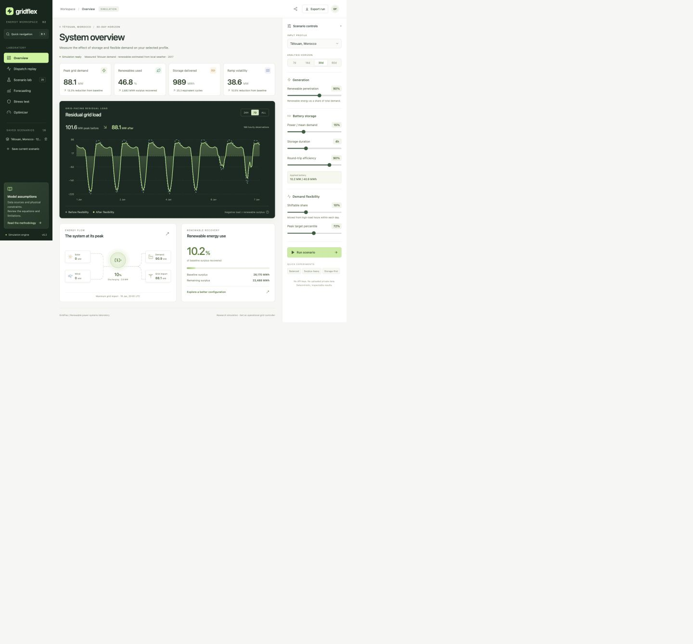

# GridFlex

[](https://github.com/hajarmrifag/gridflex-ai/actions/workflows/test.yml)


**Simulate renewable generation, battery storage and flexible electricity demand.**

GridFlex combines a React/TypeScript workspace, a bounded FastAPI simulation API, and an independently testable scientific engine. Explore real public profiles, replay every hour of battery dispatch, compare storage configurations, and see exactly where a simple controller falls short of perfect foresight.



[Methodology](docs/methodology.md) · [Architecture](docs/architecture.md) · [Performance](benchmarks/README.md) · [Data provenance](data/README.md) · [Deployment](docs/deployment.md)

## The workspace

| View | What you can do |
| --- | --- |
| **Overview** | Inspect peak demand, renewable utilisation, battery delivery and volatility; zoom the residual-load chart to a day, week or full horizon. |
| **Dispatch replay** | Play, pause, step or scrub through hourly power flows and state of charge. Download the complete dispatch CSV. |
| **Scenario lab** | Explore 20 combinations of storage duration and demand flexibility in a selectable heatmap; apply a result to the workspace. |
| **Forecasting** | Compare chronological gradient-boosting predictions with 24-hour persistence, including negative improvements when the baseline wins. |
| **Stress test** | Increase evening demand and derate renewables while keeping installed generation and the original dispatch target fixed. |
| **Optimizer** | Minimize peak import with perfect foresight, then minimize cycling; choose surplus-only/grid charging and an optional terminal-charge requirement. |

Save up to six scenario snapshots **on the current device**, compare and restore them, export versioned settings/results as JSON, or copy a link that recreates the same configuration. A keyboard-accessible command palette (`⌘/Ctrl K`), mobile navigation, explicit loading/errors, and reduced-motion support complete the workspace. Shared links require the recipient to have access to the app's address; local URLs are not public deployments.

Battery power defaults to a percentage of system mean demand, and duration determines energy capacity. This keeps sizing meaningful for both a city and a national grid. A zero-hour battery is an exact no-storage experiment.

## Run the full application

Requires Python 3.11+ and Node.js 22.12+ (Node 24 recommended).

```bash
python3 -m venv .venv
source .venv/bin/activate
pip install -e ".[api,dev]"
npm ci --prefix frontend
```

Start the API:

```bash
uvicorn api.main:app --reload --host 127.0.0.1 --port 8000
```

In a second terminal, start the workspace:

```bash
npm run dev --prefix frontend
```

Open **http://127.0.0.1:5173**. Vite proxies `/api` to the local backend. The API documentation is at **http://127.0.0.1:8000/api/docs**. No API key, model download, external database or paid service is required. Swagger's documentation UI loads its assets from a CDN; the workspace itself uses local assets only.

For a single production server:

```bash
npm run build --prefix frontend
uvicorn api.main:app --host 127.0.0.1 --port 8000
```

The API serves the built frontend at `/`. Build before starting the server. See [deployment](docs/deployment.md) for Docker and operational limits.

### Original Streamlit research interface

The existing research interface remains available and now computes only the selected view:

```bash
pip install -e ".[research]"
streamlit run app.py
```

The [existing Streamlit deployment](https://gridflex-energy-sim.streamlit.app/) runs the repository's deployed version. It is separate from the new React workspace and does not automatically become the new application when a branch is created.

## Measured engine improvements

A same-process benchmark against `63efed2`, with identical synthetic profiles and seven timed repetitions, measured:

| Horizon | Demand shifting | Shift + battery pipeline |
| --- | ---: | ---: |
| 30 days | 37.5× faster | 25.1× faster |
| 60 days | 47.4× faster | 31.9× faster |
| 365 days | 63.0× faster | 43.9× faster |

All compared numeric output columns were identical in these cases. These are **CPU kernel measurements on one machine**, not network or whole-application speedup claims. The API/UI accepts horizons up to 60 days; the annual case exercises engine scaling. [Recorded timings, environment and reproduction command](benchmarks/README.md).

The workspace also avoids hidden-view model fitting, caches deterministic computations with bounded entries, compresses API responses, lazy-loads secondary views, and uses SVG charts without shipping Plotly to the browser.

## Scientific guarantees and limits

- Daily demand energy is conserved during shifting; flat residual-load quartiles remain unchanged.
- Battery dispatch respects power, state-of-charge and efficiency constraints at each interval.
- The LP first solves peak import, then throughput within an explicit numerical tolerance. Cycling penalties cannot quietly worsen its primary objective.
- Forecast evaluation is chronological. Imputed target hours and observations whose lags touch imputed hours are excluded.
- Missing files, non-finite values, duplicate timestamps and irregular sampling fail explicitly. The German sample has a known missing day; application loaders explicitly interpolate those hours and disclose the count when the selected horizon includes them.
- Tétouan demand is measured; its renewable profiles are estimated from local weather. Germany uses measured historical demand and generation. Synthetic mode is labeled and seeded.

The full experiment is retrospective: the threshold and daily demand shifts use the selected historical profile. The optimizer has perfect foresight. Neither is represented as an operational forecasting/control system. Initial stored energy can be consumed; restore terminal charge in the optimizer when that constraint matters. GridFlex does not model transmission constraints, markets, degradation costs or outage probabilities.

## Validation

```bash
pytest
ruff check .
npm run format:check --prefix frontend
npm run build --prefix frontend
# Build first; the browser suite uses the production server.
cd frontend
npx playwright install chromium
npm test
```

CI runs engine/API tests on Python 3.11 and 3.12, then builds and runs Chromium journeys covering configuration, snapshots, comparison, dispatch replay, all compute labs, exports and mobile navigation. Tests cover numerical conservation, invalid inputs, lexicographic optimality, terminal constraints, cached-input immutability, request limits and forecast edge cases.

Research experiments remain reproducible:

```bash
pip install -e ".[research]"
python scripts/run_experiments.py
python scripts/benchmark.py --baseline-ref 63efed2 --repeats 7
```

The research figures and [recorded experiment results](docs/experiments.csv) use the current engine, an exact no-storage baseline and surplus-only charging for both dispatch policies. See [experiment setup](docs/experiments.md) for assumptions. Computational timing results are recorded separately in `benchmarks/`.
