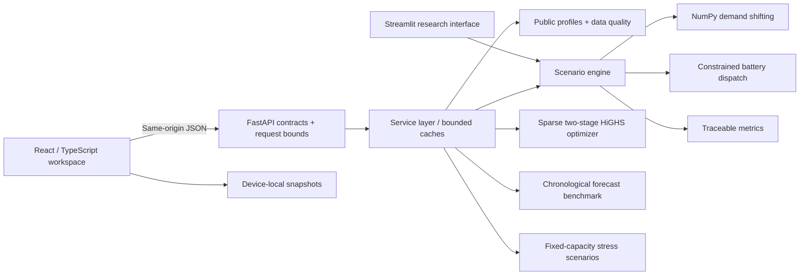

# Architecture

GridFlex separates presentation, orchestration and physics. The React workspace and the retained Streamlit interface both use the same core calculations.

## Boundaries

- `src/`: pure data transformations and numerical routines. No HTTP, browser state or framework dependencies. Inputs are copied; caches are never mutated by computations.
- `api/models.py`: finite, bounded request contracts. Unknown fields are rejected. Source names are an enum rather than filesystem paths; horizons are restricted to 7/14/30/60 days.
- `api/service.py`: profile loading, battery sizing, provenance and JSON serialization. Cached keys are immutable request models. Input profiles, simulations and each expensive lab have fixed cache limits.
- `api/main.py`: synchronous computational endpoints dispatched by FastAPI's worker threads, a two-slot compute semaphore, 16 KB streamed-body cap, gzip and response security headers. The semaphore rejects saturation with HTTP 503 and `Retry-After`; it does not create an unbounded work queue.
- `frontend/src/api.ts`: one request primitive and cancellation/stale-result protection. Controls are drafts until explicitly applied. Aborting a browser request suppresses its UI result; it does not terminate a server computation already running.
- `frontend/src/views/`: lazy-loaded product surfaces. SVG plots preserve hourly data; the UI is bounded to 1,440 observations. No browser chart-library runtime is needed.
- Snapshots contain settings and summary metrics, are versioned, capped at six, and stay in browser local storage. They are not cross-device accounts. Exports and scenario URLs provide explicit portability.

## API surface

| Method / path | Purpose |
| --- | --- |
| `GET /api/health` | Liveness and engine version |
| `POST /api/simulate` | Versioned scenario metadata, metrics and full dispatch series |
| `POST /api/compare` | Twenty storage-duration/flexibility combinations |
| `POST /api/forecast` | Holdout predictions and baseline/model errors |
| `POST /api/optimize` | Peak-optimal dispatch with optional charging/end-charge constraints |
| `POST /api/stress` | Stressed series and metrics with fixed installed generation |
| `GET /api/docs` | Interactive request documentation |

The browser never chooses a file path, executes an arbitrary expression, downloads a model or sends credentials. The API operates exclusively on bundled public/synthetic profiles. A scenario identifier hashes its validated settings; the engine version is included separately. It is an identifier, not authentication or a signature.

## Computation

Demand shifting uses positional arrays and one assignment per output column instead of repeated pandas `.loc` writes. It groups by calendar windows (including 23/25-hour DST days), computes NumPy quartiles, uses disjoint donors/receivers and preserves daily energy.

The LP uses O(n) sparse constraints and two solves: peak first; throughput second with peak constrained to the first optimum plus `max(1e-7 MW, abs(peak) × 1e-9)`. Positive `cycling_penalty` enables the tie-break; its magnitude no longer changes the peak optimum. Each solve has a 20-second limit. Stored energy is not exported. Grid charging remains the Python API default for compatibility, while the user interface defaults to surplus-only for a comparable heuristic benchmark.

The forecast model is seeded and disables random early-stopping validation. It learns only on the first 80% of usable chronological rows. Interpolated targets and lag dependencies are excluded. A perfect naive forecast reports percentage improvement as `null`, not NaN or infinity.

## Scaling limits

This is a single-process research service, not a distributed job platform. Caches and admission limits are per worker. Two workers double their memory and concurrency budgets. Solver timeouts, a bounded horizon and prompt overload responses make the intended workload explicit. For larger multi-user workloads, move CPU work to bounded job workers, add per-user quotas at the reverse proxy, and use shared job/result storage. Authentication is deliberately absent because this version has no private datasets or server-side user records.
